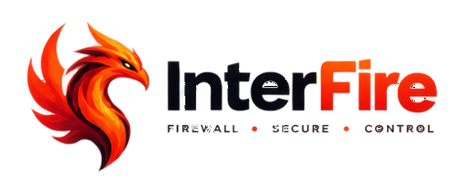

# InterFire

<p align="center">
  
</p>

<p align="center">
  <strong>Linux-first Rust application firewall.</strong>
</p>

<p align="center">
  <a href="https://github.com/Interchouette-ITC/InterFire/actions/workflows/ci.yml"></a>
  <a href="https://codecov.io/gh/Interchouette-ITC/InterFire"></a>
</p>

Linux-first **application firewall** in Rust: attribute outbound connections to
processes, match durable rules, and accept or drop via NFQUEUE when the
operator installs the InterFire-owned queue rule and the daemon has caps.

Canonical repo: [Interchouette-ITC/InterFire](https://github.com/Interchouette-ITC/InterFire).

**Status today:** The daemon and CLI speak a versioned Unix-socket protocol,
persist TOML rules, resolve process identity via `/proc`, attach a TCP-connect
eBPF observer when capabilities allow, consume ring-buffer events, and can bind
NFQUEUE **4242** for allow/deny (prompt and unattributed → deny until answered
over IPC). Live filtering needs an InterFire-owned nftables queue rule and
root/caps; use `--no-ebpf` and/or `--no-nfqueue` for non-root smoke. Interactive
ops use `interfire-tui`. GPUI desktop shell (`interfire-ui`) includes tray,
connection alert, Rules, Applications, Log, Profiling, and RSS gates; Debian
packaging is not shipped. Primary targets: Debian (stable) with GNOME, and
Pop!_OS. Production latency/coexistence measurements remain open.

## What you get today

| Piece | Role |
| --- | --- |
| `interfire-rules` | Deterministic application-rule matching + TOML store |
| `interfire-proto` | Versioned, bounded Unix-socket framing |
| `interfired` | Daemon: IPC, rules, ringbuf → `/proc` → rules → NFQUEUE |
| `interfirectl` | One-shot CLI: `ping`, `status`, rules / prompts / dns / audit |
| `interfire-tui` | ratatui control-plane TUI (interactive status / apps / rules / prompts / log) |
| `interfire-ebpf*` | TCP-connect observation program + aya loader |
| `interfire-ui` | GPUI desktop shell: tray, alert, Rules, Applications, Log, Profiling |
| Docs | Architecture, threat model, UX contract and studies |

Not present yet: Debian packaging (systemd unit, `.deb`, install matrix on
Debian GNOME and Pop!_OS).

## Quick start

```bash
git clone https://github.com/Interchouette-ITC/InterFire.git
cd InterFire
make ci
```

Non-root smoke (daemon + CLI on a temp socket):

```bash
cargo run -p interfire-daemon -- --socket=/tmp/interfire.sock --no-ebpf --no-nfqueue
cargo run -p interfirectl -- --socket=/tmp/interfire.sock ping
cargo run -p interfirectl -- --socket=/tmp/interfire.sock status
```

Isolated NFQUEUE accept/drop test (root, temporary network namespace only):

```bash
sudo scripts/nfqueue-spike.sh
```

Daemon allow/deny integration (root; builds debug binaries first via Make):

```bash
sudo make integration
```

Idle daemon RSS budget (< 40 MiB, non-root):

```bash
make memcheck
```

UI RSS release gates (DISPLAY or `xvfb-run`; not in `make ci`):

```bash
make memcheck-ui
```

See [`architecture.md`](architecture.md) for the verdict path and how the
isolated NFQUEUE test is scoped.

## Docs

| Doc | Topic |
| --- | --- |
| [`architecture.md`](architecture.md) | Event flow, NFQUEUE verdict path, baseline |
| [`threat-model.md`](threat-model.md) | Assets, trust boundaries, controls |
| [`ux-interfire.md`](ux-interfire.md) | Locked UI contract |
| [`ux-kerio.md`](ux-kerio.md) | Kerio-era interaction study |
| [`CONTRIBUTING.md`](CONTRIBUTING.md) | Lint bar, Make targets, PR habits |
| [`pull_request_template.md`](pull_request_template.md) | PR Summary + Test plan template |
| [`CODE_OF_CONDUCT.md`](CODE_OF_CONDUCT.md) | Community standards |
| [`SECURITY.md`](SECURITY.md) | Vulnerability reporting |
| [`brand/`](brand/) | Brand assets |
| [`../docs-dev/README.md`](../docs-dev/README.md) | Developer docs index |
| [`api-rust/`](api-rust/) | rustdoc after `make doc` |

## Layout

```text
crates/interfire-rules/          rule matching + TOML persistence
crates/interfire-proto/          IPC version + frame bounds
crates/interfire-daemon/         interfired
crates/interfirectl/             one-shot CLI
crates/interfire-tui/            ratatui control-plane TUI
ui/                              interfire-ui (GPUI desktop)
crates/interfire-ebpf/           TCP event contract + aya loader
crates/interfire-ebpf-programs/  TCP-connect eBPF program (bpfel)
docs/                            product docs (this hub)
docs/brand/                      public brand masters + size variants
docs-dev/                        developer notes
fixtures/                        rule fixtures
scripts/                         capability probe + NFQUEUE test helpers
packaging/debian/                empty (Debian packaging not implemented)
```

## Contributing

1. Read [`CONTRIBUTING.md`](CONTRIBUTING.md) and [`../docs-dev/DEVELOPMENT.md`](../docs-dev/DEVELOPMENT.md).
2. Prefer Make targets (`make ci`) over ad-hoc cargo lines.
3. One concern per PR. Commits and docs in **English**.
4. Keep enforcement claims honest: the verdict path is wired; operator nft,
   caps, and production measurements still matter.

<p align="center">
  
</p>

## Thanks

**InterFire** stands on excellent open-source projects and Linux kernel surfaces:

| Project | Role here |
| --- | --- |
| [Rust](https://www.rust-lang.org/) | Daemon, CLI, TUI, desktop shell, and crates |
| [Tokio](https://tokio.rs/) | Async runtime where the control plane needs it |
| [aya](https://aya-rs.dev/) | eBPF loader and TCP-connect observation path |
| [nftables](https://netfilter.org/projects/nftables/) / Netfilter | Operator-owned queue rule + NFQUEUE verdict path |
| [ratatui](https://ratatui.rs/) | `interfire-tui` control plane |
| [GPUI](https://www.gpui.rs/) / [gpui-kit](https://crates.io/crates/gpui-kit) | `interfire-ui` desktop shell |
| [nix](https://docs.rs/nix) | Unix IPC peer credentials and related syscalls |
| [tracing](https://tracing.rs/) | Structured daemon diagnostics |

Thank you to their maintainers and communities.

## License

**Apache-2.0** (Apache License, Version 2.0). See [`../LICENSE`](../LICENSE).

<p align="center">
  
  
</p>
